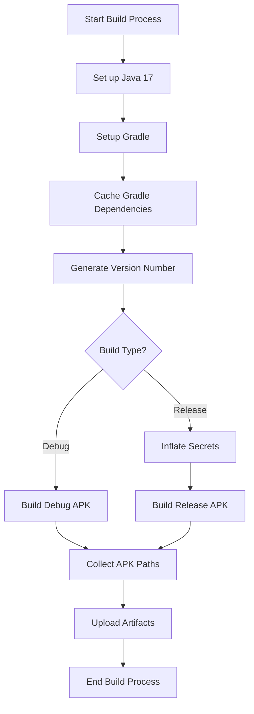

# KMP Android Build Action

## Overview

A comprehensive GitHub Action for building Android applications with support for multiple flavors,
build types, and secure release configurations.

## Features

- 🤖 Cross-flavor Android app building
- 🔒 Secure release configuration support
- 📦 Automatic artifact generation
- 🚀 Version code generation
- 🔑 Keystore and Google Services integration

## Usage Examples

### Debug Build

```yaml
- name: Checkout Repository
  uses: actions/checkout@v4
  with:
    fetch-depth: 0

- name: Build Android Debug
  uses: openMF/kmp-build-android-app-action@v1.0.0
  with:
    android_package_name: 'myapp'
```

### Release Build

```yaml
- name: Build Android Release
  uses: openMF/kmp-build-android-app-action@v1.0.0
  id: build-android
  with:
    android_package_name: 'myapp'
    build_type: 'Release'
    key_store: ${{ secrets.KEYSTORE_BASE64 }}
    google_services: ${{ secrets.GOOGLE_SERVICES_BASE64 }}
    key_store_password: ${{ secrets.KEYSTORE_PASSWORD }}
    key_store_alias: ${{ secrets.KEY_ALIAS }}
    key_store_alias_password: ${{ secrets.KEY_ALIAS_PASSWORD }}

- name: Display APK Paths
  run: |
    echo "Demo APK: ${{ steps.build-android.outputs.demo_apk }}"
    echo "Prod APK: ${{ steps.build-android.outputs.prod_apk }}"
```

## Workflow Diagram



## Android Project Configuration
Release Build Environment Variables
To use release build environment variables in your Android project, update your build.gradle files:

App-level `build.gradle`

```kotlin
android {
    namespace = "org.mifospay"

    defaultConfig {
        applicationId = "org.mifospay"
        versionName = System.getenv("VERSION") ?: project.dynamicVersion
        versionCode = System.getenv("VERSION_CODE")?.toIntOrNull() ?: 1
        vectorDrawables.useSupportLibrary = true
        testInstrumentationRunner = "androidx.test.runner.AndroidJUnitRunner"
    }

    signingConfigs {
        create("release") {
            storeFile = file(System.getenv("KEYSTORE_PATH") ?: "release_keystore.keystore")
            storePassword = System.getenv("KEYSTORE_PASSWORD") ?: "DefaultPassword"
            keyAlias = System.getenv("KEYSTORE_ALIAS") ?: "default-alias"
            keyPassword = System.getenv("KEYSTORE_ALIAS_PASSWORD") ?: "DefaultAlias"
            enableV1Signing = true
            enableV2Signing = true
        }
    }
}
```


## Inputs

### `android_package_name`

- **Description**: Name of the Android project module
- **Required**: `true`
- **Type**: `string`
- **Example**: `'app'`

### `build_type`

- **Description**: Type of build to perform
- **Required**: `true`
- **Default**: `'Debug'`
- **Options**:
    - `'Debug'`
    - `'Release'`

### `key_store` (Optional for Release)

- **Description**: Base64 encoded keystore file
- **Required**: `false` (Required for Release builds)
- **Type**: `string`

### `google_services` (Optional)

- **Description**: google-services.json file
- **Required**: `false`
- **Type**: `string`

### Additional Security Inputs

- `key_store_password`
- `key_store_alias`
- `key_store_alias_password`

## Outputs

### `artifact-name`

- **Description**: Generated artifact name
- **Type**: `string`
- **Default**: `'android-app'`

## Release Configuration

For release builds, you must provide:

- Base64 encoded keystore
- Keystore password
- Keystore alias
- Keystore alias password

## Version Generation

1. Gradle versionFile Task (Preferred)

- If version.txt can be generated via Gradle task
- Version read from version.txt
- Version code calculated based on total commit count

2. Git-based Fallback

- Uses latest Git tag
- Starts from 1.0.0 if no tags exist
- Increments patch version
- Generates version code based on commit count


## Artifact Handling

- Uploads APKs for both Demo and Prod flavors
- Artifact name defaults to `android-app`
- APK paths are dynamically discovered

## Best Practices

- Use secrets for sensitive information
- Separate debug and release configurations
- Implement secure keystore management
- Use mock files for development

## Troubleshooting

- Verify keystore and Google Services configurations
- Check Gradle build scripts
- Review GitHub Actions logs
- Ensure all required secrets are configured

## Performance Optimization

- Gradle dependency caching
- Efficient version code generation
- Minimal build step overhead

## Security Considerations

- Never commit sensitive files directly
- Use GitHub secrets for confidential data
- Rotate keys and credentials regularly

## Requirements

- Java 17
- Gradle
- Android Gradle Plugin
- Configured flavors (Demo/Prod)